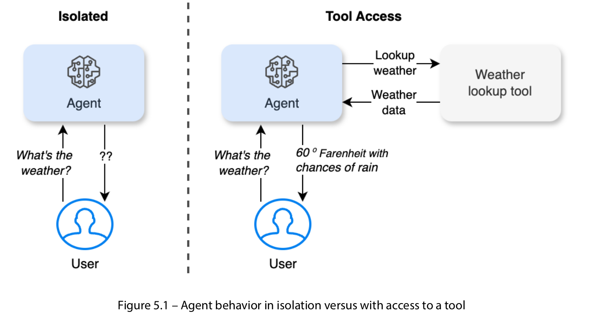
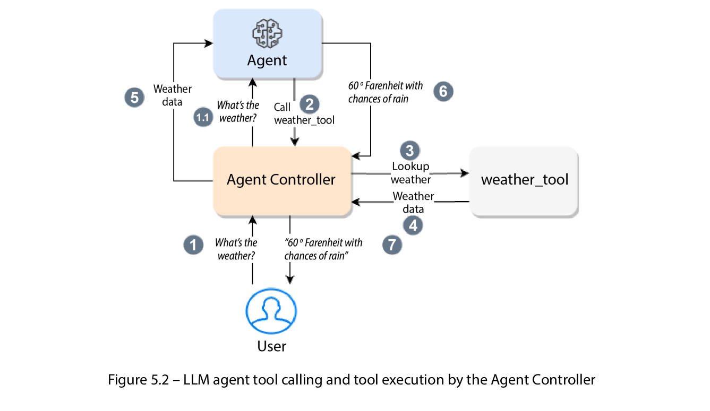
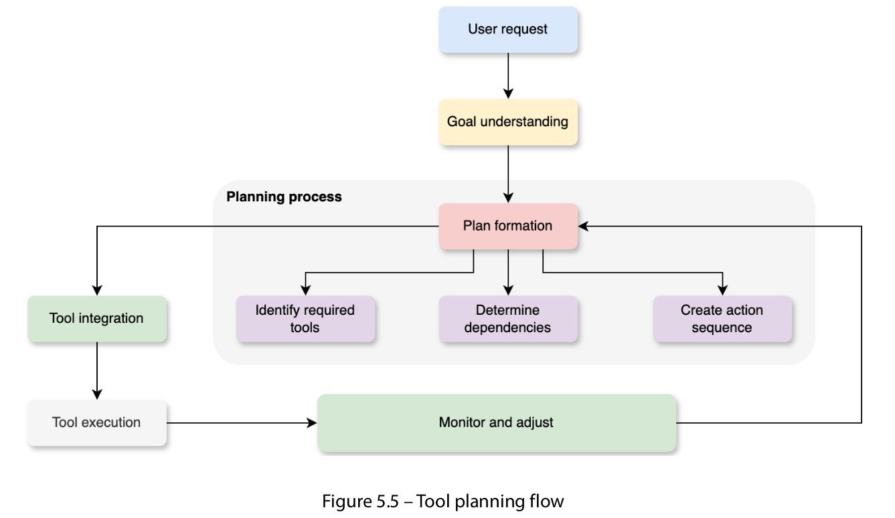
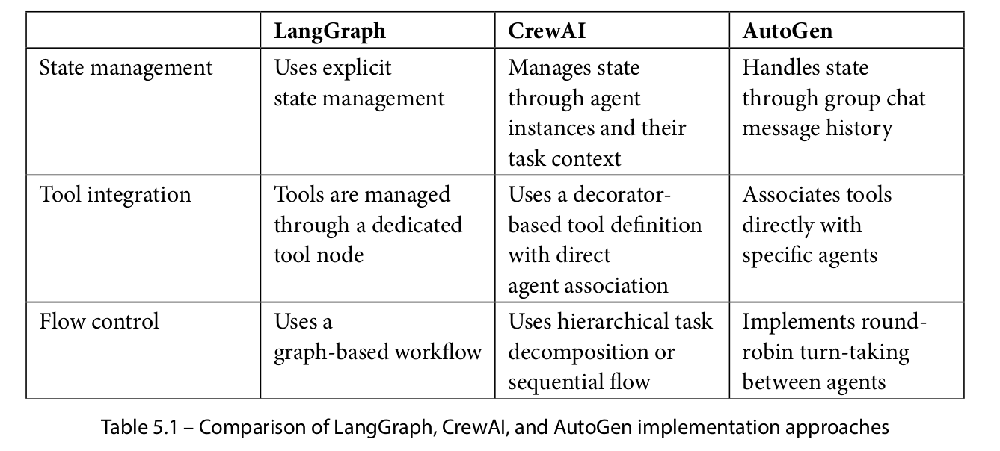

<a target="_blank" href="https://colab.research.google.com/github/PacktPublishing/Building-Agentic-AI-Systems/blob/main/Chapter_05.ipynb">
  
</a>

# Chapter 5 – Enabling Tool Use and Planning in Agents
---

### Understanding the concept of tool use in agents

At its core, **tool** usage by an intelligent agent refers to the LLM agent’s capability of leveraging external
resources or instrumentation to augment the agent’s inherent functionality and decision-making
processes. This concept extends beyond the traditional notion of an agent as a self-contained (isolated)
entity, relying solely on its internal knowledge (training data) and algorithms. Instead, it acknowledges
the potential for agents to transcend their intrinsic limitations by strategically harnessing the power
of external tools and systems.
    
For example, when you send a query (“What’s the weather?”) to an agent in isolation, the model is free
to either respond with any made-up answer or it may respond that it doesn’t know how to find the
weather. In this case, the agent will rely on the LLM’s training data, which will not have up-to-date
information about real-time weather data. On the other hand, if the LLM agent has access to a real-time weather lookup tool may be able to answer the question accurately. Tool usage enables agents to access real-time data, execute specialized tasks, and manage complex workflows that go beyond their built-in knowledge and algorithms. 
    
Figure 5.1 shows this isolated versus tool-powered behavior:



### Tool and function calling
While `tool calling` and `function calling` are often used interchangeably in the context of LLMs, they
have distinct technical differences. 

- **Function calling** refers to an LLM generating structured calls to
predefined functions within the same runtime, typically executing internal tasks such as database
lookups or calculations.

- **Tool calling**, on the other hand, enables LLMs to interact with external APIs,
services, or systems, allowing them to access real-time data and perform specialized tasks beyond
their intrinsic capabilities.

For example, an LLM using function calling might retrieve a user’s profile
from a local database, while tool calling would involve querying a weather API for live updates.
Understanding this distinction is crucial for designing AI agents that seamlessly integrate internal
logic with external systems to enhance functionality.

Figure 5.2 demonstrates the flow between an LLM agent, tool, and the Agent Controller:



### Defining tools for agents

Tools are defined with clear descriptions, typically using docstrings or a JSON schema, to communicate
their purpose, required inputs, and expected outputs to the agent. There are two main approaches to
defining tools, depending on whether you’re using a framework or working directly with LLM APIs.

### Types of tools

LLM agents can leverage various types of toolkits to enhance their capabilities and perform complex
tasks. 

Here are the main categories:
- **Application programming interfaces (APIs)**
- **Database tools**.
- **Utility functions**
- **Integration tools**
- **Hardware interface tools**

Each tool type serves specific purposes and can be combined to create powerful agent capabilities. The choice of tools depends on the agent’s role, requirements, and the complexity of tasks it needs to perform.

Understanding how agents work with these tools involves the following several key considerations that
affect their effectiveness and reliability. These aspects are crucial for developing robust agent systems
that can handle complex real-world tasks while maintaining security, handling errors gracefully, and
adapting to changing requirements:
- **Tool composition and chaining**: Agents often need to combine multiple tools to accomplish
complex tasks. Tool composition allows agents to create sophisticated workflows by chaining
tools together. For example, a travel planning agent might first use an API to check flight
availability, then a database tool to retrieve user preferences, and, finally, a utility function to
calculate optimal itineraries. This chaining capability significantly extends what agents can
accomplish beyond using tools in isolation.
- **Tool selection and decision-making**: One of the most critical aspects of tool usage is the
agent’s ability to select the appropriate tool for a given task. Agents must evaluate the context,
understand the requirements, and choose the most suitable tool or combination of tools. This
involves considering factors such as tool capabilities, reliability, performance, and cost. The
agent must also handle cases where multiple tools could solve the same problem, selecting the
most efficient option.
- **Error handling and fallbacks**: When working with tools, agents must be prepared for potential
failures and have strategies to handle them. This includes detecting failed API calls, managing
database connection issues, or handling incorrect function outputs. Robust error handling
often involves implementing fallback mechanisms, where agents can switch to alternative tools
or approaches if the primary method fails.
- **Tool state management**: Many tools maintain state or require specific initialization and
cleanup procedures. Agents need to manage these tool states effectively, ensuring proper
resource allocation and release. This includes managing database connections, maintaining
API authentication tokens and handling session states for various services.
- **Tool updates and versioning**: Tools evolve over time with new versions and capabilities. Agents
need strategies to handle tool updates, version compatibility, and deprecated features. This
might involve maintaining compatibility with multiple versions of a tool, gracefully handling
deprecated features, and adapting to new tool interfaces.
- **Tool security and access control**: Security considerations are crucial when agents interact
with tools, especially those accessing sensitive data or critical systems. This includes managing
authentication credentials, implementing proper authorization checks, and ensuring secure
communication channels. Agents must also respect rate limits and usage quotas imposed by
various tools.

Install dependencies


```python
!pip install -U openai ipywidgets crewai langchain-openai
```


```python
import getpass
import os

api_key = getpass.getpass(prompt="Enter OpenAI API Key: ")
os.environ["OPENAI_API_KEY"] = api_key
```

    Enter OpenAI API Key:  ········


```python
from crewai import Agent, Task, Crew, Process
from langchain_openai import ChatOpenAI
from typing import Dict

class HTNTravelPlanner:
    def __init__(self):
        # Create specialized agents for different aspects of travel planning
        self.flight_specialist = Agent(
            role='Flight Planning Specialist',
            goal='Handle all aspects of flight arrangements',
            backstory="Expert in airline bookings and flight logistics.",
            verbose=False
        )
        
        self.accommodation_specialist = Agent(
            role='Accommodation Specialist',
            goal='Manage all accommodation-related planning',
            backstory="Expert in hotel and accommodation arrangements.",
            verbose=False
        )

        self.activity_specialist = Agent(
            role='Vacation Activity Specialist',
            goal='Manage all activity-related planning',
            backstory="Expert in recreational activity arrangements.",
            verbose=False
        )
        
        # Define the manager LLM for the hierarchical process
        self.manager_llm = ChatOpenAI(model="gpt-4o-mini")

    def plan_travel(self, request: str) -> Dict:
        # Define the top-level task for travel planning
        travel_planning_task = Task(
            description=f"""
            Plan a comprehensive flight itinerary based on the following request:
            {request}
            
            The plan should include:
            - Flight arrangements
            - Accommodation bookings
            - Any other relevant travel components
            """,
            expected_output="A detailed flight itinerary covering all requested aspects.",
            agent=None  # No specific agent; the manager will delegate subtasks
        )

        # Create the crew with a hierarchical process
        crew = Crew(
            agents=[self.flight_specialist, self.accommodation_specialist, self.activity_specialist],
            tasks=[travel_planning_task],
            process=Process.hierarchical,
            manager_llm=self.manager_llm,
            verbose=False
        )

        # Execute the hierarchical plan
        return crew.kickoff()

```


```python
planner = HTNTravelPlanner()

# Define a travel request
request = """
I need to plan a trip to Paris from New York for 5 days.
The plan should include:
- Flights for 2 adults
- Hotel accommodations in central Paris with breakfast
- Airport transfers
- A day trip to Versailles.
"""

# Execute the hierarchical planning process
result = planner.plan_travel(request)

# Print the result
print("Final Travel Plan:")
print(result)
```

    Final Travel Plan:
    ---
    
    **Comprehensive Flight Itinerary: Trip to Paris from New York**
    
    **Travel Dates:** April 9 - April 14, 2024
    
    ### 1. **Flight Arrangements**
    - **Outbound Flight:**
       - **Airline:** Delta Air Lines
       - **Departure:** April 9, 2024, 5:15 PM EST from New York (JFK)
       - **Arrival:** April 10, 2024, 6:45 AM CET at Paris (CDG)
       - **Duration:** 7 hours 30 minutes (non-stop)
       - **Cost:** $650 per person, totaling $1,300 for two adults.
    
    - **Return Flight:**
       - **Airline:** Air France
       - **Departure:** April 14, 2024, 10:30 AM CET from Paris (CDG)
       - **Arrival:** April 14, 2024, 1:00 PM EST at New York (JFK)
       - **Duration:** 8 hours 30 minutes (non-stop)
       - **Cost:** $700 per person, totaling $1,400 for two adults.
    
    - **Total Flight Cost:** $2,700 for two adults.
    
    ---
    
    ### 2. **Hotel Accommodations**
    - **Hotel:** Hôtel Eiffel Turenne
       - **Location:** 20 Avenue de La Bourdonnais, 75007 Paris
       - **Rate:** Approximately €140 per night
       - **Breakfast:** Included
       - **Stay Duration:** April 9, 2024 - April 14, 2024 (5 nights)
       - **Total Cost:** Approximately €700 for the stay.
    
    ### 3. **Airport Transfers**
    - **Transfer Provider:** Paris Shuttle (Private Car Service)
       - **Pickup:** April 10, 2024, from Charles de Gaulle Airport (CDG) to Hôtel Eiffel Turenne.
       - **Return:** April 14, 2024, from Hôtel Eiffel Turenne back to Charles de Gaulle Airport (CDG).
       - **Total Cost for Round Trip:** Approximately €80.
    
    ---
    
    ### 4. **Day Trip to Versailles**
    - I recommend considering a guided tour from Paris, which typically includes transportation and a guided visit to the Palace of Versailles. Various companies offer half-day or full-day trips. Prices generally range from €75 to €150 per person depending on the inclusions (e.g., entrance fees, lunch).
    
    ### Summary of Estimated Costs:
    - **Flights:** $2,700
    - **Hotel:** Approximately €700
    - **Airport Transfers:** Approximately €80
    - **Day Trip to Versailles:** Approximately €150 (per person)
    
    ---
    
    To finalize the arrangements, kindly confirm whether you're ready to book the flights, hotel, airport transfers, and day trip to Versailles.


# Result / Answer

Final Travel Plan:
---

**Comprehensive Flight Itinerary: Trip to Paris from New York**

**Travel Dates:** April 9 - April 14, 2024

### 1. **Flight Arrangements**
- **Outbound Flight:**
   - **Airline:** Delta Air Lines
   - **Departure:** April 9, 2024, 5:15 PM EST from New York (JFK)
   - **Arrival:** April 10, 2024, 6:45 AM CET at Paris (CDG)
   - **Duration:** 7 hours 30 minutes (non-stop)
   - **Cost:** $650 per person, totaling $1,300 for two adults.

- **Return Flight:**
   - **Airline:** Air France
   - **Departure:** April 14, 2024, 10:30 AM CET from Paris (CDG)
   - **Arrival:** April 14, 2024, 1:00 PM EST at New York (JFK)
   - **Duration:** 8 hours 30 minutes (non-stop)
   - **Cost:** $700 per person, totaling $1,400 for two adults.

- **Total Flight Cost:** $2,700 for two adults.

---

### 2. **Hotel Accommodations**
- **Hotel:** Hôtel Eiffel Turenne
   - **Location:** 20 Avenue de La Bourdonnais, 75007 Paris
   - **Rate:** Approximately €140 per night
   - **Breakfast:** Included
   - **Stay Duration:** April 9, 2024 - April 14, 2024 (5 nights)
   - **Total Cost:** Approximately €700 for the stay.

### 3. **Airport Transfers**
- **Transfer Provider:** Paris Shuttle (Private Car Service)
   - **Pickup:** April 10, 2024, from Charles de Gaulle Airport (CDG) to Hôtel Eiffel Turenne.
   - **Return:** April 14, 2024, from Hôtel Eiffel Turenne back to Charles de Gaulle Airport (CDG).
   - **Total Cost for Round Trip:** Approximately €80.

---

### 4. **Day Trip to Versailles**
- I recommend considering a guided tour from Paris, which typically includes transportation and a guided visit to the Palace of Versailles. Various companies offer half-day or full-day trips. Prices generally range from €75 to €150 per person depending on the inclusions (e.g., entrance fees, lunch).

### Summary of Estimated Costs:
- **Flights:** $2,700
- **Hotel:** Approximately €700
- **Airport Transfers:** Approximately €80
- **Day Trip to Versailles:** Approximately €150 (per person)

---

To finalize the arrangements, kindly confirm whether you're ready to book the flights, hotel, airport transfers, and day trip to Versailles.

## Practical implementations of Tool use and planning

We will use CrewAI, LangGraph, and AutoGen to implement tool use with planning for our travel planner agentic system.

**What is AutoGen?**

`AutoGen` is an open-source framework developed by Microsoft that enables developers to build advanced applications using Large Language Models (LLMs) through the use of multiple AI agents. These agents can converse and collaborate with each other to solve complex tasks, making it easier to orchestrate, automate, and optimize workflows that involve LLMs. AutoGen is designed to maximize the performance of LLMs and overcome their limitations by allowing agents to take on specialized roles and work together seamlessly.

### Example: CrewAI

We will expand our previous example and introduce tool use. Note that the tools use static **JSON** data; however, these tools can actually perform external actions such as API calls, database updates, and so on. Let's first define all the tools we want the agent to use with CrewAI.

**NOTE**: The tool functions accept parameters in our examples; however, these parameters are not used inside the tool functions. In a typical use case, you will make use of these parameter values inside the function to execute some logic or code, e.g., run a search using an external travel search API and pass the parameters as filter conditions. This tool function code is for demonstration purposes to explain the concepts.


```python
from crewai.tools import tool
   
@tool("Search for available flights between cities")
def search_flights(origin: str, destination: str, date: str) -> Dict:
    """
    Search for available flights between cities.
    
    Args:
        origin: Departure city
        destination: Arrival city
        date: Travel date (YYYY-MM-DD)
    
    Returns:
        Dictionary containing flight options and prices
    """
    # Emulate JSON data from an API
    return {
        "flights": [
            {
                "airline": "Air France", 
                "price": 850, 
                "departure": "New York (JFK)", 
                "arrival": "Paris (CDG)", 
                "duration": "7h 30m", 
                "departure_time": "10:30 AM", 
                "arrival_time": "11:00 PM"
            },
            {
                "airline": "Delta Airlines", 
                "price": 780,
                "departure": "New York (JFK)", 
                "arrival": "Paris (CDG)", 
                "duration": "7h 45m", 
                "departure_time": "5:30 PM", 
                "arrival_time": "6:15 AM"
            },
            {
                "airline": "United Airlines", 
                "price": 920, 
                "departure": "New York (EWR)", 
                "arrival": "Paris (CDG)", 
                "duration": "7h 55m", 
                "departure_time": "8:45 PM", 
                "arrival_time": "9:40 AM"
            }
        ]
    }             

@tool("Find available hotels in a location") 
def find_hotels(location: str, check_in: str, check_out: str) -> Dict:
    """
    Search for available hotels in a location.
    
    Args:
        location: City name
        check_in: Check-in date (YYYY-MM-DD)
        check_out: Check-out date (YYYY-MM-DD)
    
    Returns:
        Dictionary containing hotel options and prices
    """
    # Emulate JSON data from an API
    return {
        "hotels": [
            {
                "name": "Paris Marriott Champs Elysees", 
                "price": 450, 
                "check_in_date": check_in, 
                "check_out_date": check_out, 
                "rating": 4.5, 
                "location": "Central Paris", 
                "amenities": [
                    "Spa", 
                    "Restaurant", 
                    "Room Service"
                ]
            },
            {
                "name": "Citadines Saint-Germain-des-Prés", 
                "price": 280, 
                "check_in_date": check_in, 
                "check_out_date": check_out, 
                "rating": 4.2, 
                "location": "Saint-Germain", 
                "amenities": [
                    "Kitchenette", 
                    "Laundry", 
                    "Wifi"
                ]
            },
            {
                "name": "Ibis Paris Eiffel Tower", 
                "price": 180, 
                "check_in_date": check_in, 
                "check_out_date": check_out, 
                "rating": 4.0, 
                "location": "Near Eiffel Tower", 
                "amenities": [
                    "Restaurant", 
                    "Bar", 
                    "Wifi"
                ]
            }
        ]
    }

@tool("Find available activities in a location")
def find_activities(location: str, date: str, preferences: str) -> Dict:
    """
    Find available activities in a location.
    
    Args:
        location: City name
        date: Activity date (YYYY-MM-DD)
        preferences: Activity preferences/requirements
        
    Returns:
        Dictionary containing activity options
    """
    # Implement actual activity search logic here
    return {
        "activities": [
            {
                "name": "Eiffel Tower Skip-the-Line", 
                "description": "Priority access to the Eiffel Tower with guided tour of 1st and 2nd floors", 
                "price": 65, 
                "duration": "2 hours", 
                "start_time": "10:00 AM", 
                "meeting_point": "Eiffel Tower South Entrance"
            },
            {
                "name": "Louvre Museum Guided Tour", 
                "description": "Expert-guided tour of the Louvre's masterpieces, including Mona Lisa", 
                "price": 85, 
                "duration": "3 hours", 
                "start_time": "2:00 PM", 
                "meeting_point": "Louvre Pyramid"
            },
            {
                "name": "Seine River Dinner Cruise", 
                "description": "Evening cruise along the Seine with 3-course French dinner and wine", 
                "price": 120, 
                "duration": "2.5 hours", 
                "start_time": "7:30 PM", 
                "meeting_point": "Port de la Bourdonnais"
            }
        ]
    }
```

**Code explenation:**

```python
# Import the tool decorator from CrewAI framework
# This decorator converts regular Python functions into tools that CrewAI agents can use
from crewai.tools import tool
   
# Define a tool for searching flights between cities
# The @tool decorator takes a description string that helps agents understand when to use this tool
@tool("Search for available flights between cities")
def search_flights(origin: str, destination: str, date: str) -> Dict:
    """
    Search for available flights between cities.
    
    Args:
        origin: Departure city
        destination: Arrival city
        date: Travel date (YYYY-MM-DD)
    
    Returns:
        Dictionary containing flight options and prices
    """
    # This function simulates an API call to a flight booking service
    # In production, this would make actual API calls to services like Amadeus, Skyscanner, etc.
    
    # Return mock flight data as a dictionary
    # Each flight contains essential booking information
    return {
        "flights": [
            # Flight option 1: Air France flight with morning departure
            {"airline": "Air France", "price": 850, "departure": "New York (JFK)", 
             "arrival": "Paris (CDG)", "duration": "7h 30m", 
             "departure_time": "10:30 AM", "arrival_time": "11:00 PM"},
            
            # Flight option 2: Delta Airlines with evening departure
            {"airline": "Delta Airlines", "price": 780, "departure": "New York (JFK)", 
             "arrival": "Paris (CDG)", "duration": "7h 45m", 
             "departure_time": "5:30 PM", "arrival_time": "6:15 AM"},
            
            # Flight option 3: United Airlines from Newark airport
            {"airline": "United Airlines", "price": 920, "departure": "New York (EWR)", 
             "arrival": "Paris (CDG)", "duration": "7h 55m", 
             "departure_time": "8:45 PM", "arrival_time": "9:40 AM"}
        ]}             

# Define a tool for finding hotels in a specific location
# CrewAI agents can call this tool when they need accommodation information
@tool("Find available hotels in a location") 
def find_hotels(location: str, check_in: str, check_out: str) -> Dict:
    """
    Search for available hotels in a location.
    
    Args:
        location: City name
        check_in: Check-in date (YYYY-MM-DD)
        check_out: Check-out date (YYYY-MM-DD)
    
    Returns:
        Dictionary containing hotel options and prices
    """
    # Simulates calling a hotel booking API (e.g., Booking.com, Hotels.com)
    # The function uses the check_in and check_out parameters in the response
    
    # Return mock hotel data with various price points and amenities
    return {
        "hotels": [
            # Luxury option: High-end Marriott hotel
            {"name": "Paris Marriott Champs Elysees", "price": 450, 
             "check_in_date": check_in, "check_out_date": check_out, 
             "rating": 4.5, "location": "Central Paris", 
             "amenities": ["Spa", "Restaurant", "Room Service"]},
            
            # Mid-range option: Apartment-style accommodation
            {"name": "Citadines Saint-Germain-des-Prés", "price": 280, 
             "check_in_date": check_in, "check_out_date": check_out, 
             "rating": 4.2, "location": "Saint-Germain", 
             "amenities": ["Kitchenette", "Laundry", "Wifi"]},
            
            # Budget option: Basic but comfortable Ibis hotel
            {"name": "Ibis Paris Eiffel Tower", "price": 180, 
             "check_in_date": check_in, "check_out_date": check_out, 
             "rating": 4.0, "location": "Near Eiffel Tower", 
             "amenities": ["Restaurant", "Bar", "Wifi"]}
        ]}

# Define a tool for discovering activities and attractions
# This tool helps agents plan the itinerary for travelers
@tool("Find available activities in a location")
def find_activities(location: str, date: str, preferences: str) -> Dict:
    """
    Find available activities in a location.
    
    Args:
        location: City name
        date: Activity date (YYYY-MM-DD)
        preferences: Activity preferences/requirements (e.g., "cultural", "outdoor", "family-friendly")
        
    Returns:
        Dictionary containing activity options
    """
    # In a real implementation, this would:
    # 1. Parse the preferences string to understand user interests
    # 2. Query activity booking APIs (GetYourGuide, Viator, etc.)
    # 3. Filter results based on availability for the specified date
    
    # Return mock activity data for Paris tourism
    return {
        "activities": [
            # Popular tourist attraction with skip-the-line access
            {"name": "Eiffel Tower Skip-the-Line", 
             "description": "Priority access to the Eiffel Tower with guided tour of 1st and 2nd floors", 
             "price": 65, "duration": "2 hours", 
             "start_time": "10:00 AM", "meeting_point": "Eiffel Tower South Entrance"},
            
            # Cultural experience at world-famous museum
            {"name": "Louvre Museum Guided Tour", 
             "description": "Expert-guided tour of the Louvre's masterpieces including Mona Lisa", 
             "price": 85, "duration": "3 hours", 
             "start_time": "2:00 PM", "meeting_point": "Louvre Pyramid"},
            
            # Evening dining experience with sightseeing
            {"name": "Seine River Dinner Cruise", 
             "description": "Evening cruise along the Seine with 3-course French dinner and wine", 
             "price": 120, "duration": "2.5 hours", 
             "start_time": "7:30 PM", "meeting_point": "Port de la Bourdonnais"}
        ]}
```


```python
from crewai import Agent, Task, Crew, Process
from langchain_openai import ChatOpenAI
from typing import Dict

class TravelPlannerCrewAI:
    def __init__(self):        

        # Create specialized agents for different aspects of travel planning
        self.travel_specialist = Agent(
            role='An expert travel concierge',
            goal='Handle all aspects of travel planning',
            backstory="Expert in airline bookings and flight logistics, hotel bookings, and booking vacation activities.",
            tools=[search_flights, find_hotels, find_activities],
            verbose=False
        )

    def plan_travel(self, request: str) -> Dict:
        # Define the top-level task for travel planning
        travel_planning_task = Task(
            description=f"""
            Plan a comprehensive travel and leisure itinerary based on the following request:
            {request}
            
            The plan should include:
            - Flight arrangements
            - Accommodation bookings
            - Any other relevant travel components
            """,
            expected_output="A detailed travel itinerary covering all requested aspects.",
            agent=self.travel_specialist 
        )

        # Create the crew with a hierarchical process
        crew = Crew(
            agents=[self.travel_specialist],
            tasks=[travel_planning_task],
            process=Process.sequential,
            # manager_llm=self.manager_llm,
            verbose=False
        )

        # Execute the hierarchical plan
        return crew.kickoff()
```


```python
planner = TravelPlannerCrewAI()

# Define a travel request
request = """
I need to plan a trip to Paris from New York for 5 days.
"""

# Execute the hierarchical planning process
result = planner.plan_travel(request)

# Print the result
print("Final Travel Plan:")
print(result)
```

    Final Travel Plan:
    **Travel Itinerary to Paris from New York (May 1-6, 2024)**
    
    **Flight Arrangements:**
    1. Airline: Air France
       - Departure: New York (JFK) on May 1, 2024, at 10:30 AM
       - Arrival: Paris (CDG) on May 1, 2024, at 11:00 PM
       - Duration: 7h 30m
       - Price: $850
    
    2. Return Flight: 
       - Departure: Paris (CDG) on May 6, 2024, at 12:00 PM
       - Arrival: New York (JFK) on May 6, 2024, at 2:30 PM
       - Price: Included in the round-trip fare
    
    **Accommodation Bookings:**
    1. Hotel: Paris Marriott Champs Elysees
       - Location: Central Paris
       - Check-in: May 1, 2024
       - Check-out: May 6, 2024
       - Price: $450 per night
       - Rating: 4.5
       - Amenities: Spa, Restaurant, Room Service
    
    **Activities Booked:**
    1. **May 2, 2024:**
       - Eiffel Tower Skip-the-Line Tour
         - Price: $65
         - Duration: 2 hours
         - Start Time: 10:00 AM
         - Meeting Point: Eiffel Tower South Entrance
    
       - Louvre Museum Guided Tour
         - Price: $85
         - Duration: 3 hours
         - Start Time: 2:00 PM
         - Meeting Point: Louvre Pyramid
    
       - Seine River Dinner Cruise
         - Price: $120
         - Duration: 2.5 hours
         - Start Time: 7:30 PM
         - Meeting Point: Port de la Bourdonnais
    
    2. **May 3, 2024:**
       - Repeat similar bookings as May 2nd for exploration.
    
    3. **May 4, 2024:**
       - Continue with planned activities from previous days, incorporating additional sightseeing and dining options.
    
    4. **May 5, 2024:**
       - Final day in Paris with additional tours of local attractions.
    
    **Overall Summary:**
    - The total price for flights, hotel stay, and activities varies depending on choices made throughout the trip. Ensure to confirm dates when booking activities as prices can fluctuate. Enjoy your trip to Paris, filled with iconic sights, delicious dining, and cultural experiences!


# Result / Answer

Final Travel Plan:
**Travel Itinerary to Paris from New York (May 1-6, 2024)**

**Flight Arrangements:**
1. Airline: Air France
   - Departure: New York (JFK) on May 1, 2024, at 10:30 AM
   - Arrival: Paris (CDG) on May 1, 2024, at 11:00 PM
   - Duration: 7h 30m
   - Price: $850

2. Return Flight: 
   - Departure: Paris (CDG) on May 6, 2024, at 12:00 PM
   - Arrival: New York (JFK) on May 6, 2024, at 2:30 PM
   - Price: Included in the round-trip fare

**Accommodation Bookings:**
1. Hotel: Paris Marriott Champs Elysees
   - Location: Central Paris
   - Check-in: May 1, 2024
   - Check-out: May 6, 2024
   - Price: $450 per night
   - Rating: 4.5
   - Amenities: Spa, Restaurant, Room Service

**Activities Booked:**
1. **May 2, 2024:**
   - Eiffel Tower Skip-the-Line Tour
     - Price: $65
     - Duration: 2 hours
     - Start Time: 10:00 AM
     - Meeting Point: Eiffel Tower South Entrance

   - Louvre Museum Guided Tour
     - Price: $85
     - Duration: 3 hours
     - Start Time: 2:00 PM
     - Meeting Point: Louvre Pyramid

   - Seine River Dinner Cruise
     - Price: $120
     - Duration: 2.5 hours
     - Start Time: 7:30 PM
     - Meeting Point: Port de la Bourdonnais

2. **May 3, 2024:**
   - Repeat similar bookings as May 2nd for exploration.

3. **May 4, 2024:**
   - Continue with planned activities from previous days, incorporating additional sightseeing and dining options.

4. **May 5, 2024:**
   - Final day in Paris with additional tours of local attractions.

**Overall Summary:**
- The total price for flights, hotel stay, and activities varies depending on choices made throughout the trip. Ensure to confirm dates when booking activities as prices can fluctuate. Enjoy your trip to Paris, filled with iconic sights, delicious dining, and cultural experiences!

### Example: AutoGen

We will use the AutoGen framework to implement the same agentic system for our travel planner with three tools. Let's first install the framework.


```python
!pip install 'autogen-agentchat==0.4.0.dev11'
!pip install 'autogen-ext[openai]==0.4.0.dev11'
```

    Defaulting to user installation because normal site-packages is not writeable
    Collecting autogen-agentchat==0.4.0.dev11
      Downloading autogen_agentchat-0.4.0.dev11-py3-none-any.whl.metadata (1.8 kB)
    Collecting autogen-core==0.4.0.dev11 (from autogen-agentchat==0.4.0.dev11)
      Downloading autogen_core-0.4.0.dev11-py3-none-any.whl.metadata (2.2 kB)
    Collecting aioconsole (from autogen-core==0.4.0.dev11->autogen-agentchat==0.4.0.dev11)
      Downloading aioconsole-0.8.1-py3-none-any.whl.metadata (46 kB)
    Requirement already satisfied: aiohttp in /home/vodenizza/.local/lib/python3.11/site-packages (from autogen-core==0.4.0.dev11->autogen-agentchat==0.4.0.dev11) (3.12.15)
    Collecting asyncio-atexit (from autogen-core==0.4.0.dev11->autogen-agentchat==0.4.0.dev11)
      Downloading asyncio_atexit-1.0.1-py3-none-any.whl.metadata (1.5 kB)
    Requirement already satisfied: jsonref~=1.1.0 in /home/vodenizza/.local/lib/python3.11/site-packages (from autogen-core==0.4.0.dev11->autogen-agentchat==0.4.0.dev11) (1.1.0)
    Requirement already satisfied: openai>=1.3 in /home/vodenizza/.local/lib/python3.11/site-packages (from autogen-core==0.4.0.dev11->autogen-agentchat==0.4.0.dev11) (1.106.1)
    Collecting opentelemetry-api~=1.27.0 (from autogen-core==0.4.0.dev11->autogen-agentchat==0.4.0.dev11)
      Using cached opentelemetry_api-1.27.0-py3-none-any.whl.metadata (1.4 kB)
    Requirement already satisfied: pillow in /home/vodenizza/.local/lib/python3.11/site-packages (from autogen-core==0.4.0.dev11->autogen-agentchat==0.4.0.dev11) (10.4.0)
    Collecting protobuf~=4.25.1 (from autogen-core==0.4.0.dev11->autogen-agentchat==0.4.0.dev11)
      Using cached protobuf-4.25.8-cp37-abi3-manylinux2014_x86_64.whl.metadata (541 bytes)
    Requirement already satisfied: pydantic<3.0.0,>=2.0.0 in /home/vodenizza/.local/lib/python3.11/site-packages (from autogen-core==0.4.0.dev11->autogen-agentchat==0.4.0.dev11) (2.11.7)
    Requirement already satisfied: tiktoken in /home/vodenizza/.local/lib/python3.11/site-packages (from autogen-core==0.4.0.dev11->autogen-agentchat==0.4.0.dev11) (0.9.0)
    Requirement already satisfied: typing-extensions in /home/vodenizza/.local/lib/python3.11/site-packages (from autogen-core==0.4.0.dev11->autogen-agentchat==0.4.0.dev11) (4.14.1)
    Requirement already satisfied: deprecated>=1.2.6 in /home/vodenizza/.local/lib/python3.11/site-packages (from opentelemetry-api~=1.27.0->autogen-core==0.4.0.dev11->autogen-agentchat==0.4.0.dev11) (1.2.18)
    Requirement already satisfied: importlib-metadata<=8.4.0,>=6.0 in /home/vodenizza/.local/lib/python3.11/site-packages (from opentelemetry-api~=1.27.0->autogen-core==0.4.0.dev11->autogen-agentchat==0.4.0.dev11) (8.4.0)
    Requirement already satisfied: zipp>=0.5 in /home/vodenizza/.local/lib/python3.11/site-packages (from importlib-metadata<=8.4.0,>=6.0->opentelemetry-api~=1.27.0->autogen-core==0.4.0.dev11->autogen-agentchat==0.4.0.dev11) (3.23.0)
    Requirement already satisfied: annotated-types>=0.6.0 in /home/vodenizza/.local/lib/python3.11/site-packages (from pydantic<3.0.0,>=2.0.0->autogen-core==0.4.0.dev11->autogen-agentchat==0.4.0.dev11) (0.7.0)
    Requirement already satisfied: pydantic-core==2.33.2 in /home/vodenizza/.local/lib/python3.11/site-packages (from pydantic<3.0.0,>=2.0.0->autogen-core==0.4.0.dev11->autogen-agentchat==0.4.0.dev11) (2.33.2)
    Requirement already satisfied: typing-inspection>=0.4.0 in /home/vodenizza/.local/lib/python3.11/site-packages (from pydantic<3.0.0,>=2.0.0->autogen-core==0.4.0.dev11->autogen-agentchat==0.4.0.dev11) (0.4.1)
    Requirement already satisfied: wrapt<2,>=1.10 in /home/vodenizza/.local/lib/python3.11/site-packages (from deprecated>=1.2.6->opentelemetry-api~=1.27.0->autogen-core==0.4.0.dev11->autogen-agentchat==0.4.0.dev11) (1.17.2)
    Requirement already satisfied: anyio<5,>=3.5.0 in /home/vodenizza/.local/lib/python3.11/site-packages (from openai>=1.3->autogen-core==0.4.0.dev11->autogen-agentchat==0.4.0.dev11) (4.9.0)
    Requirement already satisfied: distro<2,>=1.7.0 in /usr/lib/python3/dist-packages (from openai>=1.3->autogen-core==0.4.0.dev11->autogen-agentchat==0.4.0.dev11) (1.7.0)
    Requirement already satisfied: httpx<1,>=0.23.0 in /home/vodenizza/.local/lib/python3.11/site-packages (from openai>=1.3->autogen-core==0.4.0.dev11->autogen-agentchat==0.4.0.dev11) (0.28.1)
    Requirement already satisfied: jiter<1,>=0.4.0 in /home/vodenizza/.local/lib/python3.11/site-packages (from openai>=1.3->autogen-core==0.4.0.dev11->autogen-agentchat==0.4.0.dev11) (0.10.0)
    Requirement already satisfied: sniffio in /home/vodenizza/.local/lib/python3.11/site-packages (from openai>=1.3->autogen-core==0.4.0.dev11->autogen-agentchat==0.4.0.dev11) (1.3.1)
    Requirement already satisfied: tqdm>4 in /home/vodenizza/.local/lib/python3.11/site-packages (from openai>=1.3->autogen-core==0.4.0.dev11->autogen-agentchat==0.4.0.dev11) (4.67.1)
    Requirement already satisfied: idna>=2.8 in /usr/lib/python3/dist-packages (from anyio<5,>=3.5.0->openai>=1.3->autogen-core==0.4.0.dev11->autogen-agentchat==0.4.0.dev11) (3.3)
    Requirement already satisfied: certifi in /usr/lib/python3/dist-packages (from httpx<1,>=0.23.0->openai>=1.3->autogen-core==0.4.0.dev11->autogen-agentchat==0.4.0.dev11) (2020.6.20)
    Requirement already satisfied: httpcore==1.* in /home/vodenizza/.local/lib/python3.11/site-packages (from httpx<1,>=0.23.0->openai>=1.3->autogen-core==0.4.0.dev11->autogen-agentchat==0.4.0.dev11) (1.0.9)
    Requirement already satisfied: h11>=0.16 in /home/vodenizza/.local/lib/python3.11/site-packages (from httpcore==1.*->httpx<1,>=0.23.0->openai>=1.3->autogen-core==0.4.0.dev11->autogen-agentchat==0.4.0.dev11) (0.16.0)
    Requirement already satisfied: aiohappyeyeballs>=2.5.0 in /home/vodenizza/.local/lib/python3.11/site-packages (from aiohttp->autogen-core==0.4.0.dev11->autogen-agentchat==0.4.0.dev11) (2.6.1)
    Requirement already satisfied: aiosignal>=1.4.0 in /home/vodenizza/.local/lib/python3.11/site-packages (from aiohttp->autogen-core==0.4.0.dev11->autogen-agentchat==0.4.0.dev11) (1.4.0)
    Requirement already satisfied: attrs>=17.3.0 in /home/vodenizza/.local/lib/python3.11/site-packages (from aiohttp->autogen-core==0.4.0.dev11->autogen-agentchat==0.4.0.dev11) (25.3.0)
    Requirement already satisfied: frozenlist>=1.1.1 in /home/vodenizza/.local/lib/python3.11/site-packages (from aiohttp->autogen-core==0.4.0.dev11->autogen-agentchat==0.4.0.dev11) (1.7.0)
    Requirement already satisfied: multidict<7.0,>=4.5 in /home/vodenizza/.local/lib/python3.11/site-packages (from aiohttp->autogen-core==0.4.0.dev11->autogen-agentchat==0.4.0.dev11) (6.6.3)
    Requirement already satisfied: propcache>=0.2.0 in /home/vodenizza/.local/lib/python3.11/site-packages (from aiohttp->autogen-core==0.4.0.dev11->autogen-agentchat==0.4.0.dev11) (0.3.2)
    Requirement already satisfied: yarl<2.0,>=1.17.0 in /home/vodenizza/.local/lib/python3.11/site-packages (from aiohttp->autogen-core==0.4.0.dev11->autogen-agentchat==0.4.0.dev11) (1.20.1)
    Requirement already satisfied: regex>=2022.1.18 in /home/vodenizza/.local/lib/python3.11/site-packages (from tiktoken->autogen-core==0.4.0.dev11->autogen-agentchat==0.4.0.dev11) (2025.7.34)
    Requirement already satisfied: requests>=2.26.0 in /home/vodenizza/.local/lib/python3.11/site-packages (from tiktoken->autogen-core==0.4.0.dev11->autogen-agentchat==0.4.0.dev11) (2.32.4)
    Requirement already satisfied: charset_normalizer<4,>=2 in /home/vodenizza/.local/lib/python3.11/site-packages (from requests>=2.26.0->tiktoken->autogen-core==0.4.0.dev11->autogen-agentchat==0.4.0.dev11) (3.4.2)
    Requirement already satisfied: urllib3<3,>=1.21.1 in /home/vodenizza/.local/lib/python3.11/site-packages (from requests>=2.26.0->tiktoken->autogen-core==0.4.0.dev11->autogen-agentchat==0.4.0.dev11) (2.5.0)
    WARNING: The candidate selected for download or install is a yanked version: 'autogen-agentchat' candidate (version 0.4.0.dev11 at https://files.pythonhosted.org/packages/96/21/93cfb1590c1bab01a1addaf1bdd0b1849c710fbe3cf408b469e59c751bd4/autogen_agentchat-0.4.0.dev11-py3-none-any.whl (from https://pypi.org/simple/autogen-agentchat/) (requires-python:>=3.10))
    Reason for being yanked: This version accidentally included an unintentional GPL dependency. Please upgrade to 0.4.2.
    WARNING: The candidate selected for download or install is a yanked version: 'autogen-core' candidate (version 0.4.0.dev11 at https://files.pythonhosted.org/packages/af/89/573b0396f62a0df2ab16daf5018ed27fa3694b53d12aac1c26a0ece1f2fd/autogen_core-0.4.0.dev11-py3-none-any.whl (from https://pypi.org/simple/autogen-core/) (requires-python:>=3.10))
    Reason for being yanked: This version accidentally included an unintentional GPL dependency. Please upgrade to 0.4.2.
    Downloading autogen_agentchat-0.4.0.dev11-py3-none-any.whl (57 kB)
    Downloading autogen_core-0.4.0.dev11-py3-none-any.whl (78 kB)
    Using cached opentelemetry_api-1.27.0-py3-none-any.whl (63 kB)
    Using cached protobuf-4.25.8-cp37-abi3-manylinux2014_x86_64.whl (294 kB)
    Downloading aioconsole-0.8.1-py3-none-any.whl (43 kB)
    Downloading asyncio_atexit-1.0.1-py3-none-any.whl (3.8 kB)
    Installing collected packages: protobuf, asyncio-atexit, aioconsole, opentelemetry-api, autogen-core, autogen-agentchat
      Attempting uninstall: protobuf
        Found existing installation: protobuf 6.32.0
        Uninstalling protobuf-6.32.0:
          Successfully uninstalled protobuf-6.32.0
      Attempting uninstall: opentelemetry-api
        Found existing installation: opentelemetry-api 1.36.0
        Uninstalling opentelemetry-api-1.36.0:
          Successfully uninstalled opentelemetry-api-1.36.0
      Attempting uninstall: autogen-core
        Found existing installation: autogen-core 0.7.1
        Uninstalling autogen-core-0.7.1:
          Successfully uninstalled autogen-core-0.7.1
      Attempting uninstall: autogen-agentchat━━━━━━╸━━━━━━━━━━━━━ 4/6 [autogen-core]
        Found existing installation: autogen-agentchat 0.7.19;38;114m╸━━━━━━━━━━━━━ 4/6 [autogen-core]
        Uninstalling autogen-agentchat-0.7.1:━━╸━━━━━━━━━━━━━ 4/6 [autogen-core]
          Successfully uninstalled autogen-agentchat-0.7.1249;38;114m╸━━━━━━━━━━━━━ 4/6 [autogen-core]
       ━━━━━━━━━━━━━━━━━━━━━━━━━━━━━━━━━━━━━━━━ 6/6 [autogen-agentchat] 4/6 [autogen-core]
    ERROR: pip's dependency resolver does not currently take into account all the packages that are installed. This behaviour is the source of the following dependency conflicts.
    autogen-ext 0.7.1 requires autogen-core==0.7.1, but you have autogen-core 0.4.0.dev11 which is incompatible.
    crewai 0.177.0 requires opentelemetry-api>=1.30.0, but you have opentelemetry-api 1.27.0 which is incompatible.
    opentelemetry-proto 1.36.0 requires protobuf<7.0,>=5.0, but you have protobuf 4.25.8 which is incompatible.
    opentelemetry-sdk 1.36.0 requires opentelemetry-api==1.36.0, but you have opentelemetry-api 1.27.0 which is incompatible.
    opentelemetry-semantic-conventions 0.57b0 requires opentelemetry-api==1.36.0, but you have opentelemetry-api 1.27.0 which is incompatible.
    Successfully installed aioconsole-0.8.1 asyncio-atexit-1.0.1 autogen-agentchat-0.4.0.dev11 autogen-core-0.4.0.dev11 opentelemetry-api-1.27.0 protobuf-4.25.8
    Defaulting to user installation because normal site-packages is not writeable
    Collecting autogen-ext==0.4.0.dev11 (from autogen-ext[openai]==0.4.0.dev11)
      Downloading autogen_ext-0.4.0.dev11-py3-none-any.whl.metadata (3.0 kB)
    Requirement already satisfied: autogen-core==0.4.0.dev11 in /home/vodenizza/.local/lib/python3.11/site-packages (from autogen-ext==0.4.0.dev11->autogen-ext[openai]==0.4.0.dev11) (0.4.0.dev11)
    Requirement already satisfied: aioconsole in /home/vodenizza/.local/lib/python3.11/site-packages (from autogen-core==0.4.0.dev11->autogen-ext==0.4.0.dev11->autogen-ext[openai]==0.4.0.dev11) (0.8.1)
    Requirement already satisfied: aiohttp in /home/vodenizza/.local/lib/python3.11/site-packages (from autogen-core==0.4.0.dev11->autogen-ext==0.4.0.dev11->autogen-ext[openai]==0.4.0.dev11) (3.12.15)
    Requirement already satisfied: asyncio-atexit in /home/vodenizza/.local/lib/python3.11/site-packages (from autogen-core==0.4.0.dev11->autogen-ext==0.4.0.dev11->autogen-ext[openai]==0.4.0.dev11) (1.0.1)
    Requirement already satisfied: jsonref~=1.1.0 in /home/vodenizza/.local/lib/python3.11/site-packages (from autogen-core==0.4.0.dev11->autogen-ext==0.4.0.dev11->autogen-ext[openai]==0.4.0.dev11) (1.1.0)
    Requirement already satisfied: openai>=1.3 in /home/vodenizza/.local/lib/python3.11/site-packages (from autogen-core==0.4.0.dev11->autogen-ext==0.4.0.dev11->autogen-ext[openai]==0.4.0.dev11) (1.106.1)
    Requirement already satisfied: opentelemetry-api~=1.27.0 in /home/vodenizza/.local/lib/python3.11/site-packages (from autogen-core==0.4.0.dev11->autogen-ext==0.4.0.dev11->autogen-ext[openai]==0.4.0.dev11) (1.27.0)
    Requirement already satisfied: pillow in /home/vodenizza/.local/lib/python3.11/site-packages (from autogen-core==0.4.0.dev11->autogen-ext==0.4.0.dev11->autogen-ext[openai]==0.4.0.dev11) (10.4.0)
    Requirement already satisfied: protobuf~=4.25.1 in /home/vodenizza/.local/lib/python3.11/site-packages (from autogen-core==0.4.0.dev11->autogen-ext==0.4.0.dev11->autogen-ext[openai]==0.4.0.dev11) (4.25.8)
    Requirement already satisfied: pydantic<3.0.0,>=2.0.0 in /home/vodenizza/.local/lib/python3.11/site-packages (from autogen-core==0.4.0.dev11->autogen-ext==0.4.0.dev11->autogen-ext[openai]==0.4.0.dev11) (2.11.7)
    Requirement already satisfied: tiktoken in /home/vodenizza/.local/lib/python3.11/site-packages (from autogen-core==0.4.0.dev11->autogen-ext==0.4.0.dev11->autogen-ext[openai]==0.4.0.dev11) (0.9.0)
    Requirement already satisfied: typing-extensions in /home/vodenizza/.local/lib/python3.11/site-packages (from autogen-core==0.4.0.dev11->autogen-ext==0.4.0.dev11->autogen-ext[openai]==0.4.0.dev11) (4.14.1)
    Requirement already satisfied: aiofiles in /home/vodenizza/.local/lib/python3.11/site-packages (from autogen-ext[openai]==0.4.0.dev11) (24.1.0)
    Requirement already satisfied: deprecated>=1.2.6 in /home/vodenizza/.local/lib/python3.11/site-packages (from opentelemetry-api~=1.27.0->autogen-core==0.4.0.dev11->autogen-ext==0.4.0.dev11->autogen-ext[openai]==0.4.0.dev11) (1.2.18)
    Requirement already satisfied: importlib-metadata<=8.4.0,>=6.0 in /home/vodenizza/.local/lib/python3.11/site-packages (from opentelemetry-api~=1.27.0->autogen-core==0.4.0.dev11->autogen-ext==0.4.0.dev11->autogen-ext[openai]==0.4.0.dev11) (8.4.0)
    Requirement already satisfied: zipp>=0.5 in /home/vodenizza/.local/lib/python3.11/site-packages (from importlib-metadata<=8.4.0,>=6.0->opentelemetry-api~=1.27.0->autogen-core==0.4.0.dev11->autogen-ext==0.4.0.dev11->autogen-ext[openai]==0.4.0.dev11) (3.23.0)
    Requirement already satisfied: annotated-types>=0.6.0 in /home/vodenizza/.local/lib/python3.11/site-packages (from pydantic<3.0.0,>=2.0.0->autogen-core==0.4.0.dev11->autogen-ext==0.4.0.dev11->autogen-ext[openai]==0.4.0.dev11) (0.7.0)
    Requirement already satisfied: pydantic-core==2.33.2 in /home/vodenizza/.local/lib/python3.11/site-packages (from pydantic<3.0.0,>=2.0.0->autogen-core==0.4.0.dev11->autogen-ext==0.4.0.dev11->autogen-ext[openai]==0.4.0.dev11) (2.33.2)
    Requirement already satisfied: typing-inspection>=0.4.0 in /home/vodenizza/.local/lib/python3.11/site-packages (from pydantic<3.0.0,>=2.0.0->autogen-core==0.4.0.dev11->autogen-ext==0.4.0.dev11->autogen-ext[openai]==0.4.0.dev11) (0.4.1)
    Requirement already satisfied: wrapt<2,>=1.10 in /home/vodenizza/.local/lib/python3.11/site-packages (from deprecated>=1.2.6->opentelemetry-api~=1.27.0->autogen-core==0.4.0.dev11->autogen-ext==0.4.0.dev11->autogen-ext[openai]==0.4.0.dev11) (1.17.2)
    Requirement already satisfied: anyio<5,>=3.5.0 in /home/vodenizza/.local/lib/python3.11/site-packages (from openai>=1.3->autogen-core==0.4.0.dev11->autogen-ext==0.4.0.dev11->autogen-ext[openai]==0.4.0.dev11) (4.9.0)
    Requirement already satisfied: distro<2,>=1.7.0 in /usr/lib/python3/dist-packages (from openai>=1.3->autogen-core==0.4.0.dev11->autogen-ext==0.4.0.dev11->autogen-ext[openai]==0.4.0.dev11) (1.7.0)
    Requirement already satisfied: httpx<1,>=0.23.0 in /home/vodenizza/.local/lib/python3.11/site-packages (from openai>=1.3->autogen-core==0.4.0.dev11->autogen-ext==0.4.0.dev11->autogen-ext[openai]==0.4.0.dev11) (0.28.1)
    Requirement already satisfied: jiter<1,>=0.4.0 in /home/vodenizza/.local/lib/python3.11/site-packages (from openai>=1.3->autogen-core==0.4.0.dev11->autogen-ext==0.4.0.dev11->autogen-ext[openai]==0.4.0.dev11) (0.10.0)
    Requirement already satisfied: sniffio in /home/vodenizza/.local/lib/python3.11/site-packages (from openai>=1.3->autogen-core==0.4.0.dev11->autogen-ext==0.4.0.dev11->autogen-ext[openai]==0.4.0.dev11) (1.3.1)
    Requirement already satisfied: tqdm>4 in /home/vodenizza/.local/lib/python3.11/site-packages (from openai>=1.3->autogen-core==0.4.0.dev11->autogen-ext==0.4.0.dev11->autogen-ext[openai]==0.4.0.dev11) (4.67.1)
    Requirement already satisfied: idna>=2.8 in /usr/lib/python3/dist-packages (from anyio<5,>=3.5.0->openai>=1.3->autogen-core==0.4.0.dev11->autogen-ext==0.4.0.dev11->autogen-ext[openai]==0.4.0.dev11) (3.3)
    Requirement already satisfied: certifi in /usr/lib/python3/dist-packages (from httpx<1,>=0.23.0->openai>=1.3->autogen-core==0.4.0.dev11->autogen-ext==0.4.0.dev11->autogen-ext[openai]==0.4.0.dev11) (2020.6.20)
    Requirement already satisfied: httpcore==1.* in /home/vodenizza/.local/lib/python3.11/site-packages (from httpx<1,>=0.23.0->openai>=1.3->autogen-core==0.4.0.dev11->autogen-ext==0.4.0.dev11->autogen-ext[openai]==0.4.0.dev11) (1.0.9)
    Requirement already satisfied: h11>=0.16 in /home/vodenizza/.local/lib/python3.11/site-packages (from httpcore==1.*->httpx<1,>=0.23.0->openai>=1.3->autogen-core==0.4.0.dev11->autogen-ext==0.4.0.dev11->autogen-ext[openai]==0.4.0.dev11) (0.16.0)
    Requirement already satisfied: aiohappyeyeballs>=2.5.0 in /home/vodenizza/.local/lib/python3.11/site-packages (from aiohttp->autogen-core==0.4.0.dev11->autogen-ext==0.4.0.dev11->autogen-ext[openai]==0.4.0.dev11) (2.6.1)
    Requirement already satisfied: aiosignal>=1.4.0 in /home/vodenizza/.local/lib/python3.11/site-packages (from aiohttp->autogen-core==0.4.0.dev11->autogen-ext==0.4.0.dev11->autogen-ext[openai]==0.4.0.dev11) (1.4.0)
    Requirement already satisfied: attrs>=17.3.0 in /home/vodenizza/.local/lib/python3.11/site-packages (from aiohttp->autogen-core==0.4.0.dev11->autogen-ext==0.4.0.dev11->autogen-ext[openai]==0.4.0.dev11) (25.3.0)
    Requirement already satisfied: frozenlist>=1.1.1 in /home/vodenizza/.local/lib/python3.11/site-packages (from aiohttp->autogen-core==0.4.0.dev11->autogen-ext==0.4.0.dev11->autogen-ext[openai]==0.4.0.dev11) (1.7.0)
    Requirement already satisfied: multidict<7.0,>=4.5 in /home/vodenizza/.local/lib/python3.11/site-packages (from aiohttp->autogen-core==0.4.0.dev11->autogen-ext==0.4.0.dev11->autogen-ext[openai]==0.4.0.dev11) (6.6.3)
    Requirement already satisfied: propcache>=0.2.0 in /home/vodenizza/.local/lib/python3.11/site-packages (from aiohttp->autogen-core==0.4.0.dev11->autogen-ext==0.4.0.dev11->autogen-ext[openai]==0.4.0.dev11) (0.3.2)
    Requirement already satisfied: yarl<2.0,>=1.17.0 in /home/vodenizza/.local/lib/python3.11/site-packages (from aiohttp->autogen-core==0.4.0.dev11->autogen-ext==0.4.0.dev11->autogen-ext[openai]==0.4.0.dev11) (1.20.1)
    Requirement already satisfied: regex>=2022.1.18 in /home/vodenizza/.local/lib/python3.11/site-packages (from tiktoken->autogen-core==0.4.0.dev11->autogen-ext==0.4.0.dev11->autogen-ext[openai]==0.4.0.dev11) (2025.7.34)
    Requirement already satisfied: requests>=2.26.0 in /home/vodenizza/.local/lib/python3.11/site-packages (from tiktoken->autogen-core==0.4.0.dev11->autogen-ext==0.4.0.dev11->autogen-ext[openai]==0.4.0.dev11) (2.32.4)
    Requirement already satisfied: charset_normalizer<4,>=2 in /home/vodenizza/.local/lib/python3.11/site-packages (from requests>=2.26.0->tiktoken->autogen-core==0.4.0.dev11->autogen-ext==0.4.0.dev11->autogen-ext[openai]==0.4.0.dev11) (3.4.2)
    Requirement already satisfied: urllib3<3,>=1.21.1 in /home/vodenizza/.local/lib/python3.11/site-packages (from requests>=2.26.0->tiktoken->autogen-core==0.4.0.dev11->autogen-ext==0.4.0.dev11->autogen-ext[openai]==0.4.0.dev11) (2.5.0)
    WARNING: The candidate selected for download or install is a yanked version: 'autogen-ext' candidate (version 0.4.0.dev11 at https://files.pythonhosted.org/packages/f7/f5/f4ca335fef9956b50d5b132e427c2f7a883c101a9c33c52f50c5a422b48b/autogen_ext-0.4.0.dev11-py3-none-any.whl (from https://pypi.org/simple/autogen-ext/) (requires-python:>=3.10))
    Reason for being yanked: This version accidentally included an unintentional GPL dependency. Please upgrade to 0.4.2.
    Downloading autogen_ext-0.4.0.dev11-py3-none-any.whl (100 kB)
    Installing collected packages: autogen-ext
      Attempting uninstall: autogen-ext
        Found existing installation: autogen-ext 0.7.1
        Uninstalling autogen-ext-0.7.1:
          Successfully uninstalled autogen-ext-0.7.1
    Successfully installed autogen-ext-0.4.0.dev11


```python
from autogen_agentchat.agents import AssistantAgent
from autogen_agentchat.conditions import TextMentionTermination
from autogen_agentchat.teams import RoundRobinGroupChat
from autogen_agentchat.ui import Console
from autogen_ext.models.openai import OpenAIChatCompletionClient

model_client = OpenAIChatCompletionClient(
    model="gpt-4o-mini",
)

# Define the tools/functions that agents can use
class TravelTools:
    def search_flights(self, origin: str, destination: str, date: str) -> dict:
        """Search for available flights between cities."""
        return {
            "flights": [
                {"airline": "Air France", "price": 850, "departure": "New York (JFK)", "arrival": "Paris (CDG)", "duration": "7h 30m", "departure_time": "10:30 AM", "arrival_time": "11:00 PM"},
                {"airline": "Delta Airlines", "price": 780, "departure": "New York (JFK)", "arrival": "Paris (CDG)", "duration": "7h 45m", "departure_time": "5:30 PM", "arrival_time": "6:15 AM"},
                {"airline": "United Airlines", "price": 920, "departure": "New York (EWR)", "arrival": "Paris (CDG)", "duration": "7h 55m", "departure_time": "8:45 PM", "arrival_time": "9:40 AM"}
            ]
        }

    def find_hotels(self, location: str, check_in: str, check_out: str) -> dict:
        """Search for available hotels in a location."""
        return {
            "hotels": [
                {"name": "Paris Marriott Champs Elysees", "price": 450, "check_in_date": check_in, "check_out_date": check_out, "rating": 4.5, "location": "Central Paris", "amenities": ["Spa", "Restaurant", "Room Service"]},
                {"name": "Citadines Saint-Germain-des-Prés", "price": 280, "check_in_date": check_in, "check_out_date": check_out, "rating": 4.2, "location": "Saint-Germain", "amenities": ["Kitchenette", "Laundry", "Wifi"]},
                {"name": "Ibis Paris Eiffel Tower", "price": 180, "check_in_date": check_in, "check_out_date": check_out, "rating": 4.0, "location": "Near Eiffel Tower", "amenities": ["Restaurant", "Bar", "Wifi"]}
            ]
        }

    def find_activities(self, location: str, date: str, preferences: str) -> dict:
        """Find available activities in a location."""
        return {
            "activities": [
                {"name": "Eiffel Tower Skip-the-Line", "description": "Priority access to the Eiffel Tower with guided tour", "price": 65, "duration": "2 hours", "start_time": "10:00 AM", "meeting_point": "Eiffel Tower South Entrance"},
                {"name": "Louvre Museum Guided Tour", "description": "Expert-guided tour of the Louvre", "price": 85, "duration": "3 hours", "start_time": "2:00 PM", "meeting_point": "Louvre Pyramid"},
                {"name": "Seine River Dinner Cruise", "description": "Evening cruise with dinner", "price": 120, "duration": "2.5 hours", "start_time": "7:30 PM", "meeting_point": "Port de la Bourdonnais"}
            ]
        }

# Initialize the travel tools
travel_tools = TravelTools()

# Create the travel planner assistant
flight_agent = AssistantAgent(
    name="flight_planner",
    model_client=model_client,
    tools=[travel_tools.search_flights],
    description="A helpful assistant that can plan flights itinerary for vacation trips.",
    system_message="You are a helpful assistant that can plan flight itinerary for a travel plan for a user based on their request.",
)

hotel_agent = AssistantAgent(
    name="hotel_planner",
    model_client=model_client,
    tools=[travel_tools.search_flights],
    description="A helpful assistant that can plan hotel bookings for vacation trips.",
    system_message="You are a helpful assistant that can plan hotel bookings for a travel plan for a user based on their request.",
)

activities_agent = AssistantAgent(
    name="activities_planner",
    model_client=model_client,
    tools=[travel_tools.search_flights],
    description="A helpful assistant that can suggest local activities for vacation trips.",
    system_message="You are a helpful assistant that can suggest local activities for a travel plan for a user based on their request.",
)

travel_summary_agent = AssistantAgent(
    "travel_summary_agent",
    model_client=OpenAIChatCompletionClient(model="gpt-4o"),
    description="A helpful assistant that can summarize the travel plan.",
    system_message="You are a helpful assistant that can take in all of the suggestions and advice from the other agents and provide a detailed final travel plan. You must ensure that the final plan is integrated and complete. YOUR FINAL RESPONSE MUST BE THE COMPLETE PLAN. When the plan is complete and all perspectives are integrated, you can respond with TERMINATE.",
)


termination = TextMentionTermination("TERMINATE")
group_chat = RoundRobinGroupChat(
    [flight_agent, hotel_agent, activities_agent, travel_summary_agent], termination_condition=termination
)
await Console(group_chat.run_stream(task="I need to plan a trip to Paris from New York for 5 days."))

```

### Example: LangGraph (LangChain)

We will use the LangGraph framework (From LangChain) to implement the same agentic system for our travel planner with three tools. Let's first install the framework.

`LangChain` provides a framework for developing applications that can leverage LLMs alongside other tools and data sources. In the context of agentic systems, `LangChain` provides a sub-framework known as LangGraph that is used to build powerful LLM agent-based workflows. LangGraph approaches agent-based travel planning through a workflow graph system, offering a different paradigm from both `CrewAI` and `AutoGen`. Let’s examine how this implementation works and its distinguishing characteristics.

LangGraph uses a state machine approach where the workflow is defined as a graph with nodes and
edges. 

The implementation centers around two main nodes:
- An agent node that processes messages and makes decisions.
- A tool node that executes the requested tools (flight search, hotel booking, and activity planning).

The workflow follows a cycle where the agent node evaluates the current state and either makes tool calls or provides a final response.


```python
!pip install -U langgraph langchain-openai
```

Import necessary modules


```python
from typing import List, TypedDict
import operator

# Import message types from LangChain core messages.
from langchain_core.messages import BaseMessage, HumanMessage, AIMessage

# Import StateGraph and special END node.
from langgraph.graph import StateGraph, END

# Define our state schema: all messages (chat history) will be collected here.
class TravelState(TypedDict):
    messages: List[BaseMessage]
```

Define our travel **tool** functions. Note that in this case, the tool functions return static JSON data. In the real world, these can be real API calls to travel booking systems.


```python
# Import ToolNode from the prebuilt submodule.
from langchain_core.tools import tool
from langgraph.prebuilt import ToolNode 
import json

@tool
def search_flights_lg(origin: str, destination: str, date: str) -> dict:
    """
    Search for available flights between cities.
    
    Args:
        origin: Departure city
        destination: Arrival city
        date: Travel date (YYYY-MM-DD)
    
    Returns:
        Dictionary containing flight options and prices
    """
    # Emulate JSON data from an API
    return json.dumps({
        "flights": [
            {
                "airline": "Air France", 
                "price": 850, 
                "departure": "New York (JFK)", 
                "arrival": "Paris (CDG)", 
                "duration": "7h 30m", 
                "departure_time": "10:30 AM", 
                "arrival_time": "11:00 PM"
            },
            {
                "airline": "Delta Airlines", 
                "price": 780, 
                "departure": "New York (JFK)", 
                "arrival": "Paris (CDG)", 
                "duration": "7h 45m", 
                "departure_time": "5:30 PM", 
                "arrival_time": "6:15 AM"
            },
            {
                "airline": "United Airlines", 
                "price": 920, 
                "departure": "New York (EWR)", 
                "arrival": "Paris (CDG)", 
                "duration": "7h 55m", 
                "departure_time": "8:45 PM", 
                "arrival_time": "9:40 AM"
            }
        ]
    }
                     )             

@tool
def find_hotels_lg(location: str, check_in: str, check_out: str) -> dict:
    """
    Search for available hotels in a location.
    
    Args:
        location: City name
        check_in: Check-in date (YYYY-MM-DD)
        check_out: Check-out date (YYYY-MM-DD)
    
    Returns:
        Dictionary containing hotel options and prices
    """
    # Emulate JSON data from an API
    return json.dumps({
        "hotels": [
            {"name": "Paris Marriott Champs Elysees", "price": 450, "check_in_date": check_in, "check_out_date": check_out, "rating": 4.5, "location": "Central Paris", "amenities": ["Spa", "Restaurant", "Room Service"]},
            {"name": "Citadines Saint-Germain-des-Prés", "price": 280, "check_in_date": check_in, "check_out_date": check_out, "rating": 4.2, "location": "Saint-Germain", "amenities": ["Kitchenette", "Laundry", "Wifi"]},
            {"name": "Ibis Paris Eiffel Tower", "price": 180, "check_in_date": check_in, "check_out_date": check_out, "rating": 4.0, "location": "Near Eiffel Tower", "amenities": ["Restaurant", "Bar", "Wifi"]}
        ]})

@tool
def find_activities_lg(location: str, date: str, preferences: str) -> dict:
    """
    Find available activities in a location.
    
    Args:
        location: City name
        date: Activity date (YYYY-MM-DD)
        preferences: Activity preferences/requirements
        
    Returns:
        Dictionary containing activity options
    """
    # Implement actual activity search logic here
    return json.dumps({
        "activities": [
            {"name": "Eiffel Tower Skip-the-Line", "description": "Priority access to the Eiffel Tower with guided tour of 1st and 2nd floors", "price": 65, "duration": "2 hours", "start_time": "10:00 AM", "meeting_point": "Eiffel Tower South Entrance"},
            {"name": "Louvre Museum Guided Tour", "description": "Expert-guided tour of the Louvre's masterpieces including Mona Lisa", "price": 85, "duration": "3 hours", "start_time": "2:00 PM", "meeting_point": "Louvre Pyramid"},
            {"name": "Seine River Dinner Cruise", "description": "Evening cruise along the Seine with 3-course French dinner and wine", "price": 120, "duration": "2.5 hours", "start_time": "7:30 PM", "meeting_point": "Port de la Bourdonnais"}
        ]})

tools = [search_flights_lg, find_hotels_lg, find_activities_lg]
tool_node = ToolNode(tools)
```

Let's associate these tools with the LLM using `bind_tools`, then we will invoke the LLM and see it respond back with output from the tools.


```python
from langchain_openai import ChatOpenAI

llm_with_tools = ChatOpenAI(model="gpt-4o-mini").bind_tools(tools)

resp = llm_with_tools.invoke("Book flight to Paris from New York on any future date").tool_calls
resp
```


    [{'name': 'search_flights_lg',
      'args': {'origin': 'New York', 'destination': 'Paris', 'date': '2024-05-01'},
      'id': 'call_ny2jiESYiFvYfTp0vtbP3BEs',
      'type': 'tool_call'}]


Define **node** functions that update the travel state.


```python
from typing import Literal

from langgraph.graph import StateGraph, MessagesState, START, END


def should_continue(state: MessagesState):
    messages = state["messages"]
    last_message = messages[-1]
    if last_message.tool_calls:
        return "tools"
    return END


def call_model(state: MessagesState):
    messages = state["messages"]
    response = llm_with_tools.invoke(messages)
    return {"messages": [response]}


workflow = StateGraph(MessagesState)

# Define the two nodes we will cycle between
workflow.add_node("agent", call_model)
workflow.add_node("tools", tool_node)

workflow.add_edge(START, "agent")
workflow.add_conditional_edges("agent", should_continue, ["tools", END])
workflow.add_edge("tools", "agent")

app = workflow.compile()
```

Let's visualize the graph workflow. Our workflow is simple, it consists of a single agent with a set of 3 tools. LangGraph will ensure to repeatedly call the appropriate tools until the task is accomplished.


```python
from IPython.display import Image, display

try:
    display(Image(app.get_graph().draw_mermaid_png()))
except Exception:
    # This requires some extra dependencies and is optional
    pass
```


    

    


Not let's run a task of planning a trip to Paris.


```python
# example with a single tool call
for chunk in app.stream(
    {"messages": [("human", "I need to plan a trip to Paris from New York for 5 days, use any future date. Budget hotels and sightseeing preferred.")]}, stream_mode="values"
):
    chunk["messages"][-1].pretty_print()
```

    ================================ Human Message =================================
    
    I need to plan a trip to Paris from New York for 5 days, use any future date. Budget hotels and sightseeing preferred.
    ================================== Ai Message ==================================
    Tool Calls:
      search_flights_lg (call_SL6YXXAftxH5fu12rWE1fdwc)
     Call ID: call_SL6YXXAftxH5fu12rWE1fdwc
      Args:
        origin: New York
        destination: Paris
        date: 2024-05-01
      find_hotels_lg (call_hYgDmr6ylXMKoGnSlUIvnagI)
     Call ID: call_hYgDmr6ylXMKoGnSlUIvnagI
      Args:
        location: Paris
        check_in: 2024-05-01
        check_out: 2024-05-06
      find_activities_lg (call_FqAI6QMSKL6Cukg2S39G105j)
     Call ID: call_FqAI6QMSKL6Cukg2S39G105j
      Args:
        location: Paris
        date: 2024-05-01
        preferences: sightseeing
    ================================= Tool Message =================================
    Name: find_activities_lg
    
    {"activities": [{"name": "Eiffel Tower Skip-the-Line", "description": "Priority access to the Eiffel Tower with guided tour of 1st and 2nd floors", "price": 65, "duration": "2 hours", "start_time": "10:00 AM", "meeting_point": "Eiffel Tower South Entrance"}, {"name": "Louvre Museum Guided Tour", "description": "Expert-guided tour of the Louvre's masterpieces including Mona Lisa", "price": 85, "duration": "3 hours", "start_time": "2:00 PM", "meeting_point": "Louvre Pyramid"}, {"name": "Seine River Dinner Cruise", "description": "Evening cruise along the Seine with 3-course French dinner and wine", "price": 120, "duration": "2.5 hours", "start_time": "7:30 PM", "meeting_point": "Port de la Bourdonnais"}]}
    ================================== Ai Message ==================================
    
    Here's a suggested itinerary for your 5-day trip from New York to Paris, including flights, budget hotels, and sightseeing activities.
    
    ### Flights from New York to Paris
    
    1. **Delta Airlines**
       - **Price**: $780
       - **Departure**: New York (JFK) at 5:30 PM
       - **Arrival**: Paris (CDG) at 6:15 AM
       - **Duration**: 7h 45m
    
    2. **Air France**
       - **Price**: $850
       - **Departure**: New York (JFK) at 10:30 AM
       - **Arrival**: Paris (CDG) at 11:00 PM
       - **Duration**: 7h 30m
    
    3. **United Airlines**
       - **Price**: $920
       - **Departure**: New York (EWR) at 8:45 PM
       - **Arrival**: Paris (CDG) at 9:40 AM
       - **Duration**: 7h 55m
    
    ### Hotels in Paris (Check-in: 2024-05-01, Check-out: 2024-05-06)
    
    1. **Ibis Paris Eiffel Tower**
       - **Price**: $180 per night
       - **Rating**: 4.0
       - **Location**: Near Eiffel Tower
       - **Amenities**: Restaurant, Bar, Wifi
    
    2. **Citadines Saint-Germain-des-Prés**
       - **Price**: $280 per night
       - **Rating**: 4.2
       - **Location**: Saint-Germain
       - **Amenities**: Kitchenette, Laundry, Wifi
    
    3. **Paris Marriott Champs Elysees**
       - **Price**: $450 per night
       - **Rating**: 4.5
       - **Location**: Central Paris
       - **Amenities**: Spa, Restaurant, Room Service
    
    ### Sightseeing Activities in Paris
    
    1. **Eiffel Tower Skip-the-Line**
       - **Price**: $65
       - **Duration**: 2 hours
       - **Start Time**: 10:00 AM
       - **Meeting Point**: Eiffel Tower South Entrance
    
    2. **Louvre Museum Guided Tour**
       - **Price**: $85
       - **Duration**: 3 hours
       - **Start Time**: 2:00 PM
       - **Meeting Point**: Louvre Pyramid
    
    3. **Seine River Dinner Cruise**
       - **Price**: $120
       - **Duration**: 2.5 hours
       - **Start Time**: 7:30 PM
       - **Meeting Point**: Port de la Bourdonnais
    
    ### Summary
    - **Total Flight Cost** (using Delta Airlines): $780
    - **Total Hotel Cost** (if using Ibis Paris Eiffel Tower for 5 nights): $900
    - **Sightseeing Total** (for all activities): $270
    - **Overall Estimated Cost**: $1950
    
    If you'd like to proceed with any of these bookings or need further assistance, feel free to ask!


#### Optional - _MemorySaver_ checkpointing

As our agentic workflow continues to execute it will update the state of the workflow since there may be logical breaks in a real-time flow. In such cases, you might want to provide a "pick-up where you left off" feature to your user. This can be implemented using a mechanism called "Checkpointing" with LangGraph using the `MemorySaver()` which introduces a level of data persistence of the entire state of the workflow. This can be a very powerful in various sitatuation such as pause-resume workflow, human intervention etc. Read more about checkpointing here - https://langchain-ai.github.io/langgraph/concepts/persistence/

To implement you can simply compile your LangGraph workflow (as we did before) with a checkpointer.


```python
from langgraph.checkpoint.memory import MemorySaver

memory = MemorySaver()
graph = workflow.compile(checkpointer=memory)

# example with a single tool call
for chunk in app.stream(
    {"messages": [("human", "I need to plan a trip to Paris from New York for 5 days, use any future date. Budget hotels and sightseeing preferred.")]}, stream_mode="values"
):
    chunk["messages"][-1].pretty_print()
```

    ================================ Human Message =================================
    
    I need to plan a trip to Paris from New York for 5 days, use any future date. Budget hotels and sightseeing preferred.
    ================================== Ai Message ==================================
    Tool Calls:
      search_flights_lg (call_8heNOCIeWQbLUpJGt08OJXAY)
     Call ID: call_8heNOCIeWQbLUpJGt08OJXAY
      Args:
        origin: New York
        destination: Paris
        date: 2024-05-01
      find_hotels_lg (call_pto4mh3caUBk8AIMlctnhIUO)
     Call ID: call_pto4mh3caUBk8AIMlctnhIUO
      Args:
        location: Paris
        check_in: 2024-05-01
        check_out: 2024-05-06
      find_activities_lg (call_hAxqDukjPyE3ynj50tiLnHNX)
     Call ID: call_hAxqDukjPyE3ynj50tiLnHNX
      Args:
        location: Paris
        date: 2024-05-01
        preferences: sightseeing
    ================================= Tool Message =================================
    Name: find_activities_lg
    
    {"activities": [{"name": "Eiffel Tower Skip-the-Line", "description": "Priority access to the Eiffel Tower with guided tour of 1st and 2nd floors", "price": 65, "duration": "2 hours", "start_time": "10:00 AM", "meeting_point": "Eiffel Tower South Entrance"}, {"name": "Louvre Museum Guided Tour", "description": "Expert-guided tour of the Louvre's masterpieces including Mona Lisa", "price": 85, "duration": "3 hours", "start_time": "2:00 PM", "meeting_point": "Louvre Pyramid"}, {"name": "Seine River Dinner Cruise", "description": "Evening cruise along the Seine with 3-course French dinner and wine", "price": 120, "duration": "2.5 hours", "start_time": "7:30 PM", "meeting_point": "Port de la Bourdonnais"}]}
    ================================== Ai Message ==================================
    
    Here’s a travel plan for your trip to Paris from New York for 5 days, including flight options, budget hotels, and sightseeing activities.
    
    ### Flight Options
    1. **Air France** 
       - Price: **$850**
       - Departure: New York (JFK) at **10:30 AM**
       - Arrival: Paris (CDG) at **11:00 PM**
       - Duration: **7h 30m**
    
    2. **Delta Airlines**
       - Price: **$780**
       - Departure: New York (JFK) at **5:30 PM**
       - Arrival: Paris (CDG) at **6:15 AM** (next day)
       - Duration: **7h 45m**
    
    3. **United Airlines**
       - Price: **$920**
       - Departure: New York (EWR) at **8:45 PM**
       - Arrival: Paris (CDG) at **9:40 AM** (next day)
       - Duration: **7h 55m**
    
    ### Budget Hotels
    1. **Ibis Paris Eiffel Tower**
       - Price: **$180** per night
       - Check-in: **2024-05-01**
       - Check-out: **2024-05-06**
       - Rating: **4.0**
       - Location: Near Eiffel Tower
       - Amenities: Restaurant, Bar, Wifi
    
    2. **Citadines Saint-Germain-des-Prés**
       - Price: **$280** per night
       - Check-in: **2024-05-01**
       - Check-out: **2024-05-06**
       - Rating: **4.2**
       - Location: Saint-Germain
       - Amenities: Kitchenette, Laundry, Wifi
    
    3. **Paris Marriott Champs Elysees**
       - Price: **$450** per night
       - Check-in: **2024-05-01**
       - Check-out: **2024-05-06**
       - Rating: **4.5**
       - Location: Central Paris
       - Amenities: Spa, Restaurant, Room Service
    
    ### Sightseeing Activities
    1. **Eiffel Tower Skip-the-Line**
       - Description: Priority access to the Eiffel Tower with a guided tour of the 1st and 2nd floors
       - Price: **$65**
       - Duration: **2 hours**
       - Start Time: **10:00 AM**
       - Meeting Point: Eiffel Tower South Entrance
    
    2. **Louvre Museum Guided Tour**
       - Description: Expert-guided tour of the Louvre's masterpieces including the Mona Lisa
       - Price: **$85**
       - Duration: **3 hours**
       - Start Time: **2:00 PM**
       - Meeting Point: Louvre Pyramid
    
    3. **Seine River Dinner Cruise**
       - Description: Evening cruise along the Seine with a 3-course French dinner and wine
       - Price: **$120**
       - Duration: **2.5 hours**
       - Start Time: **7:30 PM**
       - Meeting Point: Port de la Bourdonnais
    
    ### Summary
    - **Total Flight Options:** Lowest fare from Delta Airlines at **$780**.
    - **Budget Hotel Suggestion:** Ibis Paris Eiffel Tower at **$180** per night.
    - **Must-do Activities:** Eiffel Tower and Louvre tours along with a Seine River dinner cruise.
    
    You can choose the flight and hotel that best fit your preferences. Let me know if you need any further assistance!


### Planning for tool use

The planning process in modern AI agents is fundamentally driven by LLM capabilities, building
upon the principles we discussed in LLM-based planning and HTN approaches. Rather than following
rigid planning algorithms, agents leverage their language model’s understanding to create flexible,
context-aware plans for tool usage. 

Figure 5.5 depicts this process:



Table 5.1 illustrates some key differences between LangGraph, CrewAI, and AutoGen:




```python

```
